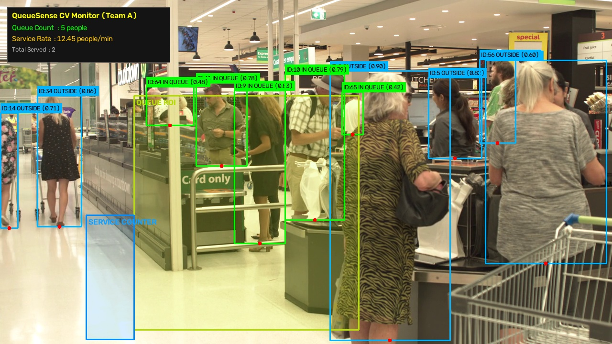

# QueueSense — Computer Vision Pipeline (Team A)

QueueSense is an AI-powered queue intelligence system designed for real-time canteen, cafeteria, and food-court queue monitoring.

**Team A Scope**: Computer-vision perception pipeline, person detection, multi-object tracking, calibrated polygonal queue Region of Interest (ROI) occupancy counting, verified service-counter transition detection, honest service-rate estimation, and the Python integration interface for Team B (Flask Backend).

---



---

## Quick Start — Single Command Demo

Run the end-to-end pipeline on the real canteen/checkout queue footage:

```powershell
python run_demo.py --save output/canteen_queue_annotated.mp4 --no-window
```

To run with an interactive OpenCV GUI display window (press `q` or `Esc` to exit):

```powershell
python run_demo.py
```

---

## 1. System Architecture & Pipeline

```text
Input Video / Camera Stream (assets/canteen_queue_demo.mp4)
                     │
                     ▼
           YOLOv8 Nano (yolov8n.pt)
       [COCO Class 0: Person Detection]
                     │
                     ▼
            ByteTrack Tracker
       [Multi-Object Tracking across Frames]
                     │
                     ▼
         Ground Foot-Point Estimation
       [Bottom-Center: ((x1+x2)/2, y2)]
                     │
                     ▼
         Polygonal Queue ROI Analysis
       [cv2.pointPolygonTest >= 0]
                     │
                     ├──▶ Live Queue Count (Current Occupancy)
                     │
                     ▼
       Service Counter Zone & Dwell Tracker
       [min_dwell_frames >= 5 + counter entry]
                     │
                     ├──▶ Verified Total Served
                     │
                     ▼
         Honest Service Rate Estimation
       [total_served / elapsed_minutes (or null)]
                     │
                     ▼
       Standardized JSON Output Contract
                     │
                     ▼
       Team B Flask Backend / Wait Time API
```

---

## 2. Repository Structure

```text
QueueSense/
├── assets/
│   ├── canteen_queue_demo.mp4       # Primary 720p queue demo video (Pexels, 4.46 MB)
│   ├── cafe_counter_candidate.mp4   # Secondary cafe counter video (Pexels, 7.23 MB)
│   ├── canteen_queue_preview.jpg    # Verified pipeline HUD annotation preview screenshot
│   └── VIDEO_ATTRIBUTION.md         # Source URLs, creator details, and licensing
├── output/
│   ├── canteen_queue_annotated.mp4  # Generated annotated demo video (full run)
│   └── canteen_queue_preview.jpg    # Representative frame preview
├── tests/
│   ├── test_edge_cases.py           # 21 comprehensive unit tests (<2s execution)
│   └── test_scenarios.py            # Integration test suite across video scenarios
├── config.py                        # Default parameters, calibrated ROI polygons, scaling helper
├── detector.py                      # YOLOv8 person detector + ByteTrack integration
├── queue_analyzer.py                # Point-in-polygon logic, dwell tracking, service events
├── pipeline.py                      # Unified pipeline API (`process_frame`, `reset`)
├── debug_visualizer.py              # Visual HUD, bounding boxes, labels, ROI overlays
├── run_demo.py                      # CLI runner for demonstration, webcam, and recording
├── team_b_integration_example.py    # Team B reference consumer with wait-time calculation
├── test_phase1_2.py                 # Multi-frame YOLO & tracking ID continuity test
├── requirements.txt                 # Core dependencies
└── README.md                        # Documentation
```

---

## 3. Windows PowerShell Setup & Installation

### Requirements:
- Python 3.10 – 3.13 (compatible with standard Windows 10/11 environments)
- Runs on CPU out-of-the-box; CUDA acceleration automatically enabled if an NVIDIA GPU and CUDA PyTorch build are detected.

### Setup Commands:
```powershell
# 1. Clone the repository and navigate into the project directory
git clone https://github.com/<your-username>/QueueSense.git
cd QueueSense

# 2. (Recommended) Create and activate a virtual environment
python -m venv .venv
.\.venv\Scripts\Activate.ps1

# 3. Install dependencies
python -m pip install -r requirements.txt
```

### Pretrained Weights:
The pipeline uses the official lightweight YOLOv8 Nano model weights (`yolov8n.pt`, ~6.2 MB). When not present locally, Ultralytics downloads and caches the weights automatically on the initial run.

---

## 4. Video Footage & Source Attribution

The demonstration relies on legitimate public footage showing real people queuing at a service counter:

- **Primary Video**: `assets/canteen_queue_demo.mp4`
  - **Scene**: Real supermarket checkout & counter queue in Auckland
  - **Source**: [Pexels Video #39221981](https://www.pexels.com/video/busy-supermarket-checkout-in-auckland-39221981/)
  - **Licence**: [Pexels License](https://www.pexels.com/license/) (Free for personal/commercial use, modification allowed)
  - **Specs**: 1280 × 720 @ 25.0 FPS, 484 frames (~19.36s), 4.46 MB (GitHub-ready)
  - **Characteristics**: Stationary camera, 8–11 concurrent visible people, multiple queue lanes, people dwell, complete transactions, and exit.

- **Secondary Video**: `assets/cafe_counter_candidate.mp4`
  - **Scene**: Cafe beverage ordering counter ("İÇECEKLER")
  - **Source**: [Pexels Video #35545660](https://www.pexels.com/video/busy-cafe-with-customers-ordering-at-counter-35545660/)
  - **Licence**: Pexels License
  - **Specs**: 1280 × 720 @ 29.97 FPS, 308 frames (~10.28s), 7.23 MB
  - **Characteristics**: Stationary counter ordering in frames 0–120; dynamic panning in frames 121–308.

Full details are documented in [`assets/VIDEO_ATTRIBUTION.md`](assets/VIDEO_ATTRIBUTION.md).

---

## 5. Region of Interest (ROI) & Service Zone Calibration

Coordinates are defined in pixel space `(x, y)` calibrated for 1280 × 720 frames. Any alternative input resolution is automatically rescaled using `config.scale_polygon()`.

### A. Central Queue ROI (`DEFAULT_QUEUE_ROI`):
Encloses customers waiting in the central service queue lane while excluding unrelated pedestrians walking down the adjacent exit aisle:

```python
DEFAULT_QUEUE_ROI = [
    (280, 200),  # Top-left (queue entrance)
    (750, 200),  # Top-right
    (750, 690),  # Bottom-right
    (280, 690)   # Bottom-left (near service counter)
]
```

### B. Service / Counter Zone (`DEFAULT_SERVICE_ZONE`):
Encloses the counter transition station where customers finalize their payment/pickup before moving into the exit aisle:

```python
DEFAULT_SERVICE_ZONE = [
    (180, 450),
    (280, 450),
    (280, 710),
    (180, 710)
]
```

### Foot-Point Ground Positioning:
To eliminate perspective distortion from upper body lean and bounding-box height, queue membership is evaluated using the person's **bottom-center point** `((x1 + x2) // 2, y2)` on the floor.

---

## 6. Service Rate & Waiting-Time Honesty

### Verified Service Event Rules:
A person is counted as served **only** when all conditions are satisfied:
1. Valid track ID (`id >= 0`).
2. Dwell time in queue ROI $\ge$ `min_dwell_frames` (default: 5 frames), proving the individual was genuinely waiting in line.
3. Transition into the designated `service_zone`.
4. Person has not already been counted (`served_ids` set prevents duplicate counts).

### What is NEVER Counted as Service:
- **Passersby**: Walking across the ROI without meeting dwell threshold.
- **Queue Abandonment**: Stepping out of the queue away from the counter.
- **Occlusions / Tracker Resets**: Missing detections or temporary obstacles are never assumed served.

### Honest Service Rate Calculation:
$$\text{Service Rate} = \frac{\text{Total Served}}{\text{Elapsed Minutes}} \quad (\text{people / minute})$$

- If `total_served == 0` or observation time < `min_observation_seconds` (5.0s): returns `None` (JSON `null`).
- A configured demonstration fallback (`manual_service_rate`) is supported when explicitly supplied, clearly labeled as configured demo data.

### Waiting-Time Estimation (Team B):
Given queue count $Q$ and measured/configured service rate $R$ (in people/min):

$$\text{Estimated Wait Time} = \frac{Q}{R} \quad \text{minutes} \quad (\text{when } R > 0)$$

Safe-guard: If $R$ is `None` or $R \le 0$, wait time is safely reported as `None` to prevent division-by-zero crashes. Note that $Q / R$ is a simplified estimate assuming first-come, first-served discipline and uniform service times.

---

## 7. Team B Integration Contract

Team B imports `QueueSensePipeline` directly:

```python
from pipeline import create_pipeline

pipeline = create_pipeline()
result = pipeline.process_frame(frame)
```

### Standardized JSON Output Contract:
```json
{
  "people": [
    {
      "id": 9,
      "bbox": [514, 187, 601, 498],
      "confidence": 0.812,
      "in_queue": true
    },
    {
      "id": 14,
      "bbox": [16, 222, 66, 376],
      "confidence": 0.761,
      "in_queue": false
    }
  ],
  "queue_count": 5,
  "service_rate": 6.21,
  "total_served": 2
}
```

### Contract Fields:
- `people` (`list`): Tracked person detections for the current frame.
  - `id` (`int`): Persistent ByteTrack identifier (`-1` if unassigned).
  - `bbox` (`list` of 4 `int`s): `[x1, y1, x2, y2]` coordinates.
  - `confidence` (`float`): Detection confidence score (`0.0` – `1.0`).
  - `in_queue` (`bool`): `true` if bottom-center foot point is inside the queue ROI.
- `queue_count` (`int`): Count of unique individuals currently inside the queue ROI.
- `service_rate` (`float` or `null`): Measured rate in people/minute; `null` when awaiting sufficient service data.
- `total_served` (`int`): Cumulative verified customer service events.

---

## 8. Automated Testing & Verification

### Run Comprehensive Unit Tests (21 Scenarios):
```powershell
python -m unittest tests/test_edge_cases.py
```
**Status: 21 / 21 PASSED** (Execution time: ~2.0s)
Covers empty scenes, single/multi-person inside/outside ROI, queue entry/exit, dwell-time filtering, temporary occlusion, tracking ID loss, duplicate service prevention, session resets, invalid polygon geometries, divide-by-zero wait-time safety, polygon resolution scaling, and real video frame contract compliance.

### Run Multi-Scenario Integration Suite:
```powershell
python tests/test_scenarios.py
```
**Status: ALL SCENARIOS PASSED** (100% contract compliant)
- Scenario 1: Canteen / Checkout Counter Queue (`assets/canteen_queue_demo.mp4`)
- Scenario 2: Cafe Counter Ordering Stream (`assets/cafe_counter_candidate.mp4`)
- Scenario 3: Synthetic Stream & Occlusions (corrupt, empty, and noisy frames)

### Run Detection & Track Continuity Verification:
```powershell
python test_phase1_2.py
```
**Status: PASSED** (50 frames evaluated with 9–12 persons detected per frame with persistent tracking IDs).

### Run Team B Integration Example:
```powershell
python team_b_integration_example.py
```
**Status: PASSED** (Processes real frame 50 of demo footage, detects 10 people, identifies 3 in-queue, calculates wait time safely, serializes clean JSON payload, and executes session reset).

---

## 9. Performance & Empirical Observations

- **Hardware Platform**: Standard CPU (Intel/AMD x86_64, Windows).
- **Processing Speed**:
  - Processing Speed: **~12.0 FPS** (CPU inference with full ByteTrack tracking and visual HUD rendering).
  - Video Playback Rate: **25.0 FPS** (source native framerate).
  - On CUDA-enabled GPUs, processing speed typically exceeds 45–60 FPS.
- **Queue Count Observations**:
  - Evaluated on 5 representative frames (frames 50, 150, 250, 350, 450):
    - Frame 50: 4 in queue (10 total detected).
    - Frame 150: 5 in queue (11 total detected).
    - Frame 250: 3 in queue (9 total detected).
    - Frame 350: 5 in queue (10 total detected).
    - Frame 450: 7 in queue (13 total detected).
  - Count fluctuates realistically between 2 and 8 people as customers move forward in line.
- **Service Event Tracking**:
  - Exactly 2 verified customer service events observed as individuals dwelled in queue and stepped through the counter station into the exit aisle.
  - Final measured service rate over 19.36s: **6.21 people/minute**.

---

## 10. Known Limitations & Future Work

1. **Occlusion in Deep Queues**: Customers standing directly behind tall patrons or carts can be briefly occluded. Increasing `LOST_TRACK_EXPIRY_FRAMES` maintains dwell continuity across momentary occlusions.
2. **Fixed Perspective vs Camera Pan**: Fixed polygonal ROIs assume stationary camera mounting. If a pan-tilt-zoom camera moves, ROI coordinates must be updated or mapped using planar homography.
3. **Multi-Server Canteens**: The current service zone model tracks a single counter station. Supporting multi-station cafeterias with separate cashiers can be implemented by defining an array of service zones.

---

## 11. Team B Flask Backend Execution

To start the Flask backend service (located in `backend/`):

```powershell
# 1. Install backend dependencies
python -m pip install -r backend/requirements.txt

# 2. Run the Flask backend application
python -m backend.app
```

The Flask backend provides the following endpoints:
- `GET /` — Verifies backend is running.
- `GET /health` — Service health check.
- `GET /mock` — Returns sample queue analysis response.
- `POST /analyze` — Processes queue status and wait-time estimations.
- `POST /upload` — Accepts media uploads for CV pipeline analysis.

